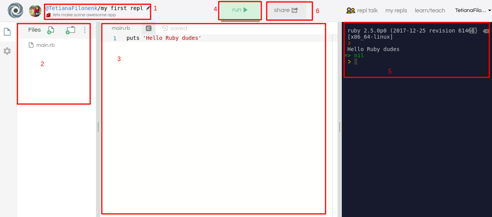

Домашнее задание к лекции 1.2 «Условия и циклы. Методы.»
===

Необходимо выполнить и предоставить на проверку следующие задачи:

## Задача №1
Разработать программу, которая будет реализовывать простой алгоритм работы "умного" вентилятора.

Программа должна позволять:
1. Включить вентилятор, через команду start(time_off), где
   `time_off - время в секундах, через которое ожидается завершение таймера`
   
2. Вентилятор всегда стартует с `time=0`. Выдать на экран сообщения при каждой итерации таймера(`time + 1`). 
   Для задержки таймера необходимо использовать команду `sleep(sec)`, где  
     `sec - значение в секундах сколько длится задержка`
     
   Принимаем во внимание один цикл итерации = одну секунду
3. Вентилятор должен завершить свою работу когда наше текущее значение time будет достигнуто ( `time >= time_off` ) 
   
Организовать работу таким образом, чтобы sec был получен через передачу параметров в терминале.

Например, таймер на 4 секунды:

`ruby filename.rb 4` 
   

## Задача №2.
Написать метод, который проверяет правильность введенного кода, введенного с консоли (gets).

Правильный код задается в программе и хранится в переменной. 

Для сравнения использовать условный оператор if. 

Результатом данной задачи дожно быть сообщение о правильности введенного значения.

## Задача №3.
Написать программу, которая будет реализовывать алгоритм работы сигнализации:

1. Включение сигнализации `turn_on()`. 
   
   Правильный код к сигнализации задается в программе и хранится в переменной.
   
   Нужно ввести с клавиатуры код и сравнить с правильным.
   
   У пользователя только три попытки (использование цикла while).
   
   Если введенный код правильный, выдать сообщение что сигнализация установлена, больше код считывать не нужно.
   
   Если код введен не правильно, вы должны дать возможность ввести его еще раз.
   
   Если код введен не правильно три раза, вы должны вывести соответствующее сообщение и предотвратить попытку ввода следующего раза.
2. Отключение сигнализации `turn_off()` 
   
   Необходимо ввести правильный код. 
   
   У пользователя также три попытки. 
   
   Если код вводится правильно - выводим сообщение на экран, что сигнализация снята.

   Если вы ошиблись, у вас отнимается попытка и выводится сообщение на экран, что вы ошиблись. 
   
   Если попыток больше нет, выводим сообщение об ошибке.

---
## Реализация

### Локально, используя командную строку

1. Перед началом работы необходимо установить ruby.

Варианты установки 

- [Windows командная строка и RubyInstaller](../installations/ruby_installer.md)

- С помощью [Ruby enVironment (Version) Manager (RVM)](../installations/rvm.md) или [Ruby version manager (Rbenv)](../installations/rbenv.md)    

- [Docker контейнер](../installations/docker.md)

2. Выполнить каждое задание в отдельном файле.
3. В личном кабинете на сайте [netology.ru](http://netology.ru/) прикрепить файлы c выполненными заданиями и отправьте работу на проверку.

### С использованием песочницы Repl

1. Зарегистрируйтесь на сайте [Repl.IT](https://repl.it/).
2. Перейдите в раздел **my repls**. 
3. Нажмите кнопку **Start coding now!**, если приступаете впервые, или **New Repl**, если у вас уже есть работы. 
4. В списке языков выберите Ruby. 
Ниже представлено как должен выглядить ваш кабинет.

4. В верхней области будет доступна возможность редактирования названия работы (1).
5. Слева вы увидете каталог файлов (2).
6. Код пишите в центральной части окна (3).
7. Посмотреть результат выполнения файла можно, нажав на кнопку **Run** (4). 

   Результат появится в правой части окна (5).
8. После окончания работы нажмите кнопку **Share** и скопируйте ссылку из поля *Share link* (6).
9. В личном кабинете на сайте [netology.ru](http://netology.ru/) в поле комментария к домашней работе вставьте скопированную ссылку и отправьте работу на проверку.

*Никаких файлов прикреплять не нужно.* 
