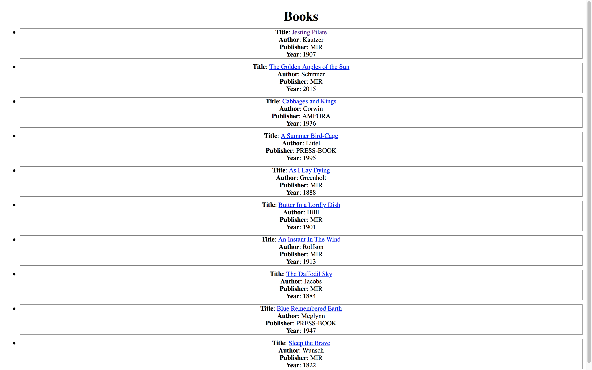
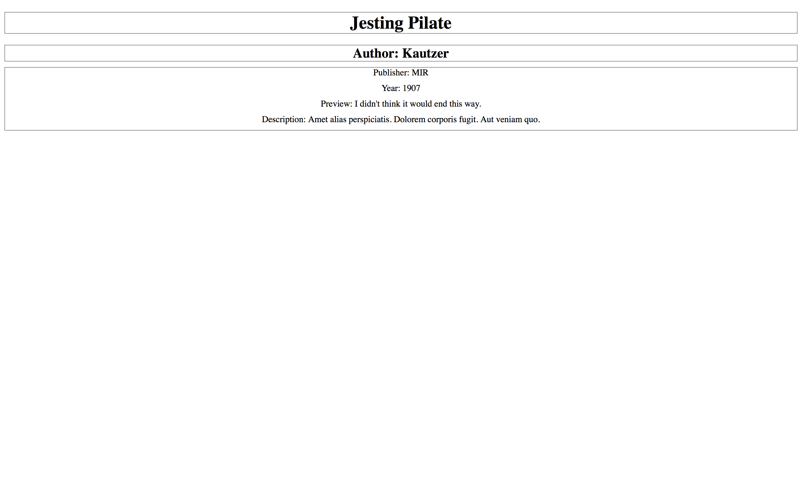
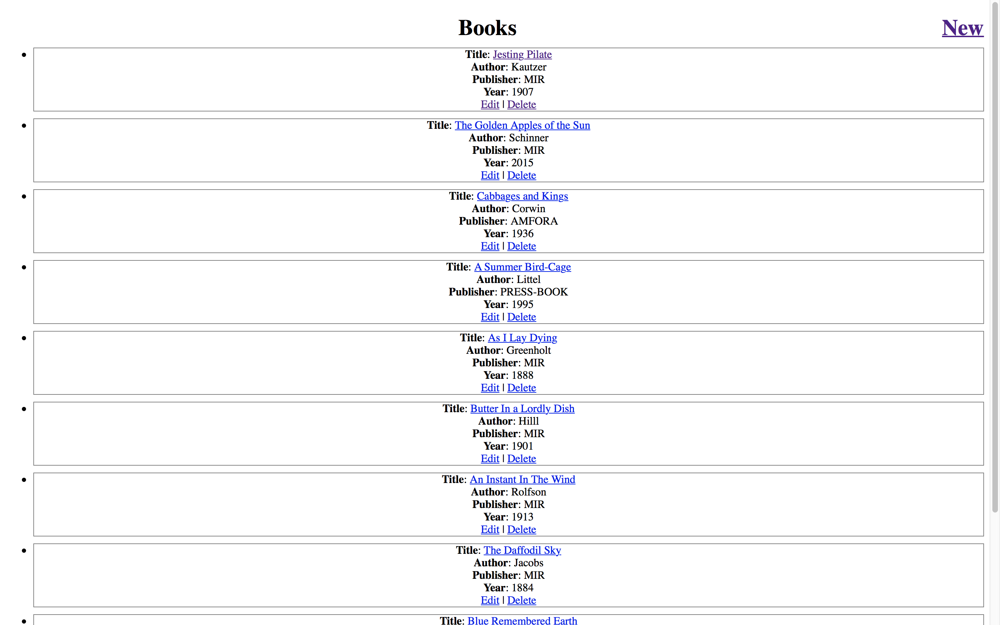
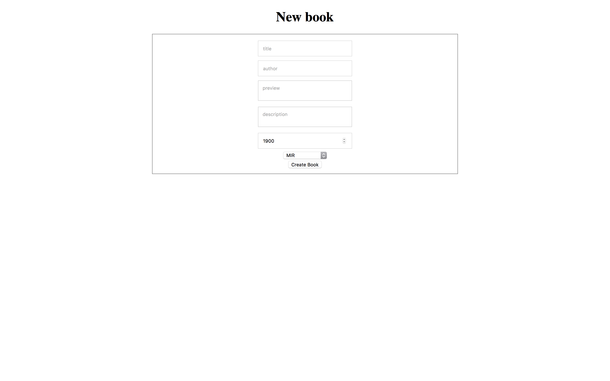
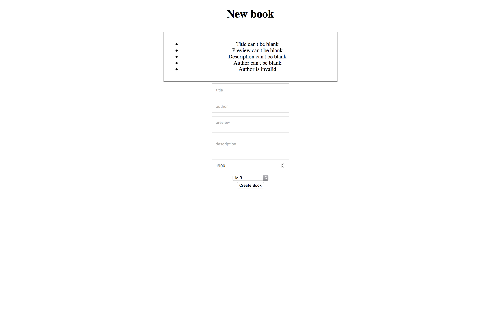
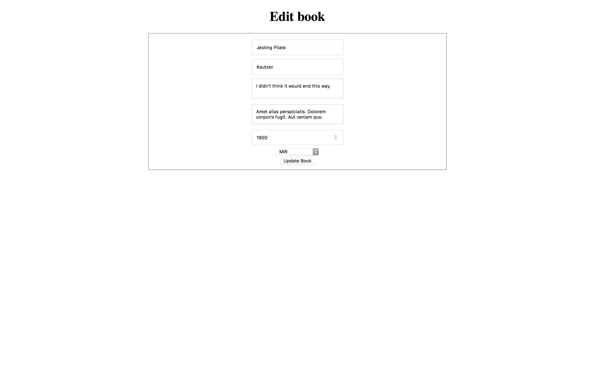

Домашнее задание к лекции 2.3 "Forms, Validations & Callbacks"
===

Предположим, мы разрабатываем онлайн-библиотеку. Давайте по шагам реализуем базовый функционал.

## Задача №1
Для начала, книги необходимо хранить в базе данных. Каждая книга имеет описание, которое включает: название, имя автора, название издательства, год выпуска, аннтацию к книге, предпросмотр первых 10 страниц книги. Чтобы подготовить нашу библиотеку к загрузке книг, необходимо создать модель `Book` и миграцию. Модель должна иметь атрибуты:
- `title`
- `preview`
- `description`
- `author`
- `publisher`
- `year`

Также нужно создать константу `PUBLISHERS`, которая будет содержать массив издательств (любые строки с названиями издательств).

Добавить следующие валидации:
- Поле `title` должно быть уникальным, его длина не должна превышать 255 символов.
- В поле `author` все буквы должны быть строчными, а первая - заглавной (то есть, указываем только фамилию автора, например, Достоевский, но не достоевский или досТОевский). Длина не должна превышать 50 символов.
- `publisher` должен быть издательством из массива PUBLISHERS.
- поле `year` не должно быть больше текущего года и не должно более, чем на 200, меньше текущего года (не создаем книги, изданные > 200 лет назад).
- Все поля должны быть обязательными для заполнения.

Для преобразования имени к правильному формату нужно воспользоваться callback’ом `before_validation`.

## Задача №2
Теперь, давайте начнем отображать книги, которые есть в базе.
Создайте контроллер `BooksController` с двумя экшнами - `index` и `show`.
- `index` должен выводить список всех книг со следующей информацией:
  - 160 символов названия
  - фамилию автора
  - издателя
  - год издания
- `show` должен выводить всю информацию по конкретной книге

**Примеры**:

## Задача №3
Библиотека постоянно меняется - новые книги добавляются, старые удаляются, может выйти новое издание. Чтобы иметь возможность добавлять, удалять и редактировать книги, добавьте в `BooksController` экшны `new`, `edit`, `create`, `update` и `delete`.
В файлах представления для `new` и `edit`, создайте форму, которая будет связана с объектом модели `Book` (используйте хелпер `form_for`). В форму добавить все необходимые поля. Вверху формы сделать специальный элемент `div`, в котором будут отображаться ошибки при создании/обновлении моделей.
Опишите необходимую бизнес-логику для создания, редактирования и удаления книги.
- экшны `new` и `edit` должны иметь каждый свое представление и отдавать их при запросе;
- экшн `create` принимает параметры книги и пытается создать новую запись в базе данных. В случае успеха перенаправляет пользователя на страницу только что созданной книги, в случае ошибки оставляет пользователя на странице и отображает ошибки;
- экшн `update` принимает параметры книги и пытается обновить существующую запись. В случае успеха перенаправляет пользователя на страницу только что обновленной книги, в случае ошибки оставляет пользователя на странице и отображает ошибки;
- экшн `delete` удаляет книгу.
Таким образом на выходе должен получиться `CRUD` контроллер, с представлениями для просмотра, создания, редактирования и удаления книг.
В списке книг добавьте каждой книге ссылку на изменение и удаление, а также в вехней части списка добавьте ссылку на создание книги.

**Примеры**:

# Инфраструктура

В папке `booktaste` уже лежит `Rails`-приложение, в котором вам надо написать свой код. Также, в папке лежат файлы `Dockerfile` и `docker-compose.yml`, необходимые для его запуска.

## Порядок установки

1. Зайдите в папку `booktaste`
2. Наберите `docker-compose build`. Эта команда создаст два контейнера - с приложением и базой данных, а также установит необходимые `gem`ы внутри контейнера.
2. Создайте базу данных: запустите `docker-compose run --rm web rails db:create`.
2. Чтобы применить миграции, запустите `docker-compose run --rm web rails db:migrate`.
3. Запустите `docker-compose up`. Теперь в браузере вы можете набрать `http://localhost:3000` и попасть в ваше приложение.

## Проверка

После выполнения всех трех заданий вы можете проверить себя, набрав команду `docker-compose run --rm web rspec`. Если все тесты будут "зелеными", то, скорее всего, все хорошо.

